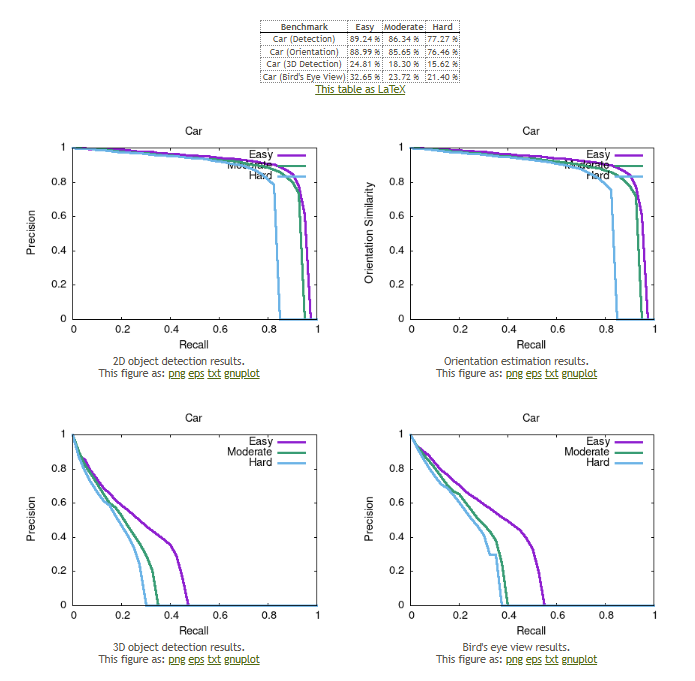

# MonoHMP: Monocular 3D Object Detection with Hybrid Visual Encoding and Multi-scale Depth Prediction

MonoHMP is a transformer-based monocular 3D object detector that achieves a better balance between detection accuracy and inference efficiency. It introduces an efficient hybrid visual encoder, a multi-scale depth predictor, a 6D dynamic anchor box query mechanism, and a mixed supervision strategy to significantly improve performance.

## Highlights

- 🚀 **High Performance**: Achieves over **1.7% improvement** on KITTI dataset across all difficulty levels (Easy, Moderate, Hard).
- ⚡ **Fast Inference**: Runs at **48 ms per frame**, suitable for real-time applications.
- 🎯 **Accurate Depth Estimation**: Uses PDCM and DFIM modules to enhance depth prediction.
- 📦 **Compact and Efficient**: Reduces computation while maintaining strong visual feature representation.

## Coming Soon

📢 Our code will be **open-sourced soon**. Stay tuned for updates and implementation details.

---

For questions or collaboration, please contact us at [your_email@example.com].

